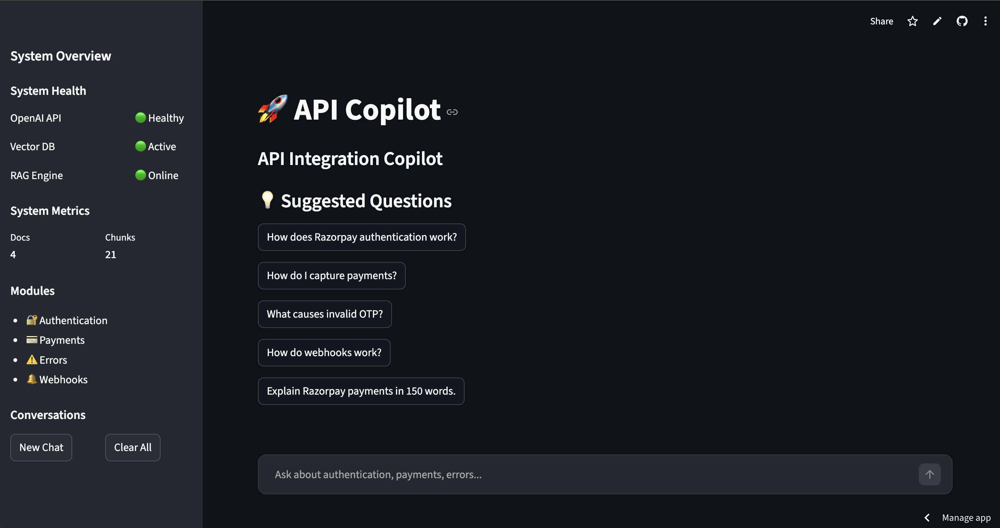
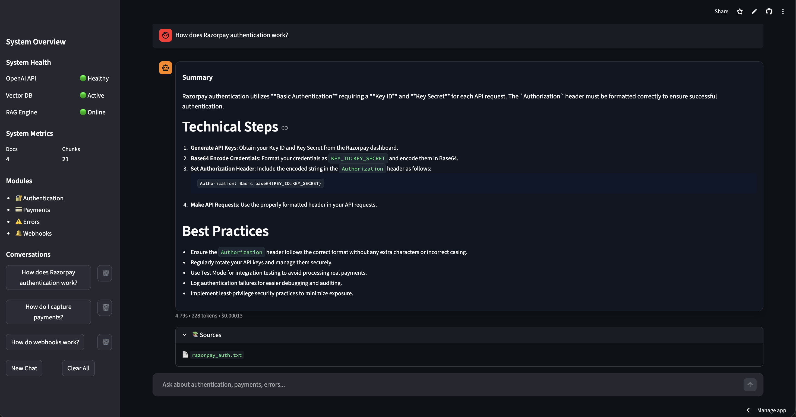

```md
# 🚀 API Copilot

AI-powered API Integration Assistant built using Retrieval-Augmented Generation (RAG), OpenAI, ChromaDB, and Streamlit.

Live Demo: https://api-copilot.streamlit.app/

---

## Overview

API Copilot helps developers:

- Understand API authentication flows
- Debug integration issues
- Retrieve implementation guidance
- Explain payment/webhook workflows
- Generate concise API troubleshooting responses

The system uses a RAG pipeline over indexed API documentation to provide grounded, developer-focused answers.

---

## Features

### AI-Powered API Assistance
- OpenAI-based response generation
- Context-aware API explanations
- Technical troubleshooting guidance

### Retrieval-Augmented Generation (RAG)
- ChromaDB vector database
- Semantic chunk retrieval
- Context injection before LLM generation

### Streamlit UI
- Chat-style interface
- Conversation threads
- Source references
- Suggested API questions
- Real-time response metrics

### Deployment & Infra
- Streamlit Cloud deployment
- Docker-compatible architecture
- GitHub Actions CI pipeline
- Environment-based secret management

---

## Architecture

```text
User Query
    ↓
Streamlit Frontend
    ↓
RAG Retrieval Layer
    ↓
ChromaDB Vector Search
    ↓
OpenAI Response Generation
    ↓
Formatted AI Response
```

---

## Tech Stack

| Layer                 | Technology                    |
|-----------------------|-------------------------------|
| Frontend              | Streamlit                     |
| LLM                   | OpenAI GPT                    |
| Vector DB             | ChromaDB                      |
| Embeddings            | OpenAI Embeddings             |
| Backend               | Python                        |
| CI/CD                 | GitHub Actions                |
| Deployment            | Streamlit Community Cloud     |
| Containerization      | Docker                        |

---

## Live Demo

https://api-copilot.streamlit.app/

---

## Screenshots

### Landing Page



### Query + Sources




---

## Local Development

### Clone Repository

```bash
git clone https://github.com/wilsonfebin/api-copilot.git
cd api-copilot
```

### Create Virtual Environment

```bash
python3.11 -m venv venv
source venv/bin/activate
```

### Install Dependencies

```bash
pip install -r requirements.txt
```

### Configure Secrets

Create:

```text
.streamlit/secrets.toml
```

Add:

```toml
OPENAI_API_KEY="your-api-key"
```

### Run Application

```bash
streamlit run app.py
```

---

## Docker Support

The project also supports Docker-based deployment architecture for local containerized execution.

---

## CI Pipeline

GitHub Actions pipeline includes:

- Dependency installation
- Python environment setup
- Linting and validation
- Deployment readiness checks

---

## Repository Structure

```text
api-copilot/
│
├── app.py
├── backend/
├── rag/
├── llm/
├── data/
├── utils/
├── chroma_db/
├── requirements.txt
├── Dockerfile
└── .github/workflows/
```

---

## Current Capabilities

- API authentication guidance
- Payment integration assistance
- Error troubleshooting
- Webhook explanation support
- Context-grounded AI responses

---

## Future Enhancements

- Streaming responses
- Multi-document ingestion
- Authentication layer
- Kubernetes deployment
- Redis caching
- Observability & tracing
- Multi-model support

---

## Author

Febin Wilson

GitHub:
https://github.com/wilsonfebin

---

## License

MIT License
```