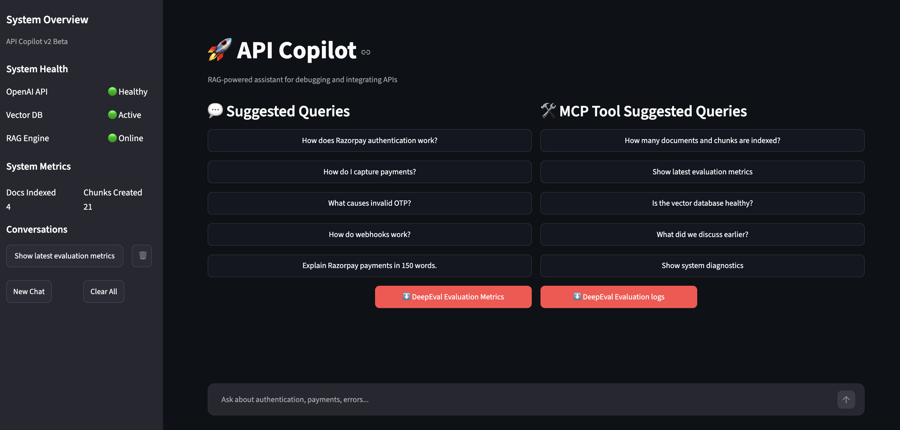
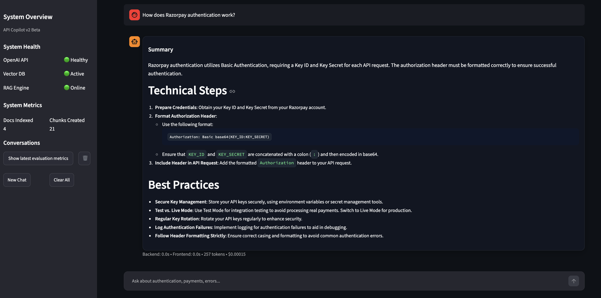
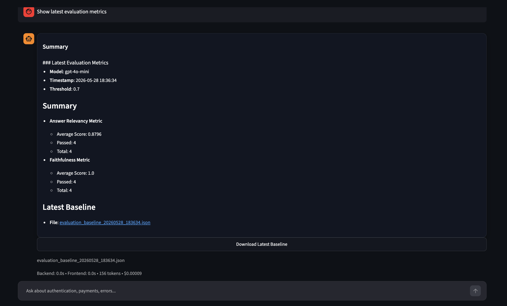

# 🚀 API Copilot — Agentic RAG & MCP Platform

> Production-grade AI-powered API Integration Copilot built using FastAPI, Streamlit, OpenAI APIs, ChromaDB, LangGraph, MCP, DeepEval, and Dockerized microservices.

---

# 📸 Screenshots

## 🖥 Main UI



---

## 🛠 Query Response



---

## 📊 Evaluation Metrics



---

# ✨ Features

## 🧠 Core AI Features

- Retrieval-Augmented Generation (RAG)
- Semantic vector search using embeddings
- Intent-aware prompt specialization
- Metadata-filtered retrieval
- Context-grounded response generation
- Source-aware answer generation
- Context compression
- Persistent conversation memory
- Multi-turn follow-up handling

---

# 🤖 Agentic AI Features

- LangGraph workflow orchestration
- Intent classification
- MCP tool routing
- Retrieval tool orchestration
- Structured workflow state management
- Multi-node execution pipeline
- Guardrail validation layer
- Workflow tracing and observability

Supported intents:

- AUTH
- PAYMENTS
- ERRORS
- WEBHOOKS
- GENERAL
- MCP_SYSTEM

---

# 🛠 MCP Features

The platform includes an internal MCP-style tool orchestration layer.

Supported MCP tools:

- RetrievalTool
- HealthTool
- MetricsTool
- DiagnosticsTool
- EvaluationTool
- ThreadMemoryTool

Capabilities:

- Tool routing
- Tool execution logging
- System diagnostics
- Vector DB inspection
- Evaluation metrics retrieval
- Conversation memory access
- Health monitoring
- Runtime diagnostics

---

# 📊 Evaluation & Guardrails

Evaluation-driven optimization using DeepEval.

Implemented metrics:

- Answer Relevancy
- Faithfulness
- Retrieval grounding validation
- Evaluation baseline persistence

Current benchmark:

```text
Answer Relevancy: 0.88–1.00
Faithfulness: 1.00
```

Guardrails include:

- Response validation
- Structured output checks
- Retrieval grounding enforcement
- Workflow validation nodes
- Hallucination prevention layer

---

# 🖥 Platform Features

- Dockerized frontend/backend architecture
- FastAPI backend services
- Streamlit interactive UI
- Persistent thread memory
- MCP demo interface
- Evaluation downloads
- Structured observability
- Health monitoring APIs
- Metrics APIs
- Cost tracking
- Token monitoring
- Source visibility
- Thread continuity

---

# 🏗 Architecture

```text
                           ┌────────────────────┐
                           │   Streamlit UI     │
                           │    Frontend        │
                           └─────────┬──────────┘
                                     │
                                     ▼
                        ┌────────────────────────┐
                        │      FastAPI API       │
                        │    SSE + REST Layer    │
                        └─────────┬──────────────┘
                                  │
                                  ▼
                    ┌──────────────────────────────┐
                    │       LangGraph Engine       │
                    │                              │
                    │  • IntentNode               │
                    │  • ToolNode                 │
                    │  • RetrievalNode            │
                    │  • PromptNode               │
                    │  • ResponseNode             │
                    │  • ValidationNode           │
                    └─────────────┬────────────────┘
                                  │
                ┌─────────────────┴─────────────────┐
                ▼                                   ▼
      ┌────────────────────┐             ┌────────────────────┐
      │    MCP Router      │             │    RAG Pipeline    │
      │                    │             │                    │
      │ • RetrievalTool    │             │ • Vector Search    │
      │ • MetricsTool      │             │ • Metadata Filter  │
      │ • HealthTool       │             │ • Context Build    │
      │ • DiagnosticsTool  │             │ • Prompt Assembly  │
      └─────────┬──────────┘             └─────────┬──────────┘
                │                                  │
                ▼                                  ▼
      ┌────────────────────┐             ┌────────────────────┐
      │      ChromaDB      │             │     OpenAI API     │
      │    Vector Store    │             │  LLM + Embeddings  │
      └────────────────────┘             └────────────────────┘
```

---

# 🔄 LangGraph Workflow

```text
User Query
→ IntentNode
→ MCP ToolNode
→ RetrievalNode
→ PromptNode
→ ResponseNode
→ ValidationNode
→ Evaluation Logging
```

---

# 🧩 MCP Demo Queries

The platform exposes MCP-style operational tooling directly through the UI.

Example MCP queries:

```text
How many documents and chunks are indexed?
Show latest evaluation metrics
Is the vector database healthy?
What did we discuss earlier?
Show system diagnostics
```

These queries bypass normal RAG retrieval and invoke internal MCP tools directly.

---

# 📂 Project Structure

```text
api-copilot/
│
├── app.py
│
├── backend/
│   ├── main.py
│   │
│   ├── langgraph/
│   │   ├── graph.py
│   │   ├── nodes.py
│   │   └── state.py
│   │
│   ├── mcp/
│   │   ├── router.py
│   │   ├── registry.py
│   │   └── tools/
│   │       ├── retrieval_tool.py
│   │       ├── health_tool.py
│   │       ├── metrics_tool.py
│   │       ├── diagnostics_tool.py
│   │       ├── evaluation_tool.py
│   │       └── memory_tool.py
│   │
│   ├── routes/
│   │   ├── query.py
│   │   ├── health.py
│   │   ├── metrics.py
│   │   └── stream.py
│   │
│   ├── services/
│   │   └── rag_service.py
│   │
│   ├── guardrails/
│   │   └── validator.py
│   │
│   └── utils/
│       └── logger.py
│
├── evaluation/
│   ├── run_evaluation.py
│   ├── test_cases.py
│   └── baselines/
│
├── rag/
│   ├── ingest.py
│   ├── chunk.py
│   ├── embed.py
│   ├── retrieve.py
│   └── vector_store.py
│
├── chroma_db/
├── logs/
├── data/
├── docker-compose.yml
├── Dockerfile.backend
├── Dockerfile.ui
└── README.md
```

---

# ⚙️ Tech Stack

```text
Frontend        : Streamlit
Backend         : FastAPI
LLM             : OpenAI GPT APIs
Embeddings      : OpenAI Embeddings
Vector Database : ChromaDB
Orchestration   : LangGraph
Protocol Layer  : MCP-style Tool Routing
Evaluation      : DeepEval
Guardrails      : Validation Layer
Observability   : Structured Logging
Deployment      : Docker + Docker Compose
Language        : Python
```

---

# 📈 Observability & Metrics

Tracked metrics:

- Backend latency
- Frontend latency
- Token usage
- Cost estimation
- Retrieval sources
- LangGraph node timings
- MCP tool execution
- Guardrail validation
- Workflow tracing
- Request diagnostics
- Evaluation baselines

---

# 📜 Example Workflow Logs

```text
INFO | LANGGRAPH NODE | IntentNode
INFO | GRAPH STATE | intent=AUTH
INFO | MCP ROUTER | intent=AUTH | tool=retrieval
INFO | MCP TOOL | RetrievalTool
INFO | RETRIEVAL SOURCES | ['razorpay_auth.txt']
INFO | NODE TIME | RetrievalNode | 0.41s
INFO | LANGGRAPH NODE | ValidationNode
INFO | GUARDRAIL CHECK | passed=True
INFO | RAG DONE | intent=AUTH | 5.18s | tokens=303
INFO | BASELINE SAVED | evaluation_baseline_20260528.json
```

---

# 🧪 Evaluation Example

```bash
python -m evaluation.run_evaluation \
  --model=gpt-4o-mini \
  --threshold=0.7
```

Example output:

```text
Answer Relevancy : 1.0
Faithfulness     : 1.0
Cases Evaluated  : 4
```

---

# 🚀 Running Locally

## Clone Repository

```bash
git clone https://github.com/wilsonfebin/api-copilot.git

cd api-copilot
```

---

## Setup Backend

```bash
pip install -r requirements_backend.txt
```

Run FastAPI:

```bash
uvicorn backend.main:app --reload
```

---

## Setup Frontend

```bash
pip install -r requirements_ui.txt
```

Run Streamlit:

```bash
streamlit run app.py
```

---

# 🐳 Docker Deployment

```bash
docker-compose up --build
```

---

# 📌 Key Engineering Concepts Implemented

- Retrieval-Augmented Generation (RAG)
- Agentic AI orchestration
- LangGraph workflows
- MCP tool routing
- Intent-aware retrieval
- Vector similarity search
- Metadata-based filtering
- DeepEval evaluation pipelines
- Guardrails & validation
- Structured observability
- Dockerized microservices
- Modular backend architecture

---

# 🛣 Roadmap

- External MCP server support
- Hybrid search (BM25 + vector)
- OpenTelemetry tracing
- Redis caching
- Multi-model routing
- Kubernetes deployment
- Role-based guardrails
- Multi-agent workflows
- Autonomous retrieval planning
- Tool-calling LLMs
- Distributed evaluation pipelines

---

# 👨‍💻 Author

## Febin Wilson

Built as a production-style AI systems engineering platform focused on:

- Agentic orchestration
- Retrieval systems
- Evaluation-driven optimization
- AI observability
- MCP workflows
- LangGraph orchestration
- Practical GenAI architecture